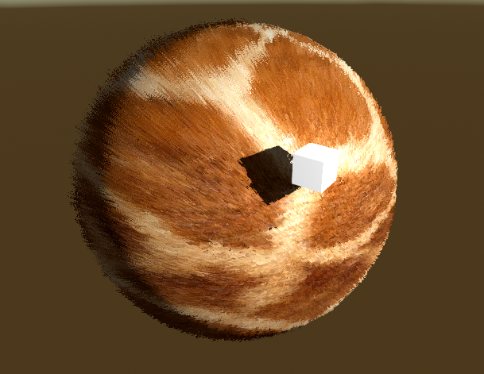
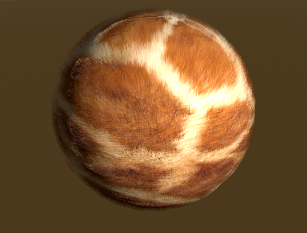

# Unity Fur Shader

### I deleted all fur shaders except new one "Surface Cutout" shader
It's supposed to be second material on your mesh because there are no surface, only fur rendered.
I made it cutout and surface so unity can light fur properly, also fog works aswell. But cutout shader looks pretty weird without antialiasing
Also it costs more perfomance than the original shader.

I'm planning to add rim lighting, but not yet. 
Also if you want this shader to be transparent: go to `FurShaderSurface` and for every pass change `alphatest:_Cutoff` to `alpha`. It will be lit, but won't accept any shadows

### Thanks
[Original Repo](https://github.com/Sorumi/UnityFurShader)

[Fur Effects - Teddies, Cats, Hair ....](http://www.xbdev.net/directx3dx/specialX/Fur/index.php)

[Fur shader - Shaders Laboratory](http://www.shaderslab.com/demo-60---fur-shader.html)
